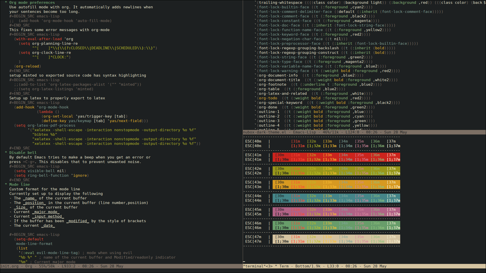
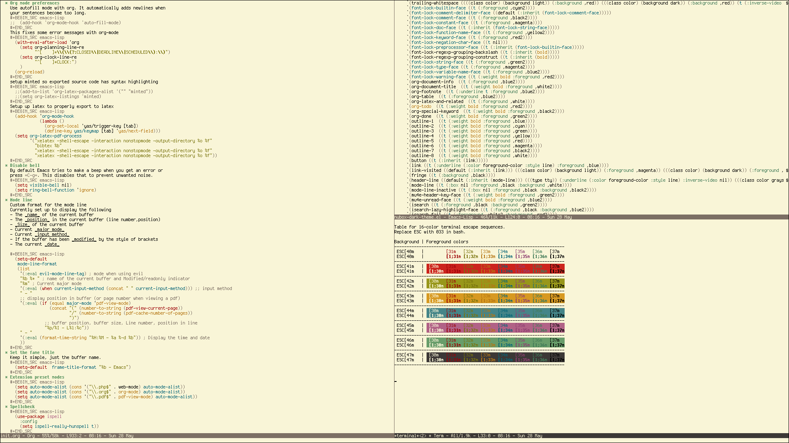
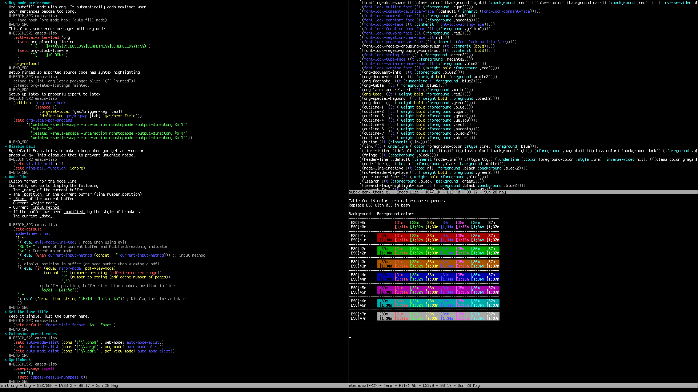

# Nubox
A set of colorful matching themes

# Screenshots

Dark version

Light version

Version for terminals with limited color support

# Installation

The theme is avaible on [MELPA](https://melpa.org/#/nubox) . If you
use MELPA you can install this theme using

`M-x package-install tao-theme`

alternatively download the files nubox-light-theme.el,
nubox-dark-theme.el and nubox-tty-theme.el and put them in a path in
your custom-theme-load-path

# Notes

This theme is largely based of
[gruvbox](https://github.com/morhetz/gruvbox). Compared to other
gruvbox ports this theme has a few new things

- Proper ansi-term color support
- Matching dark and light theme
- Purposfully limited to 16 colors
- Higher contrast
- Different colors for dired, mu4e and org mode.
- An special version of the theme that work on 8-color and 16-color terminals

